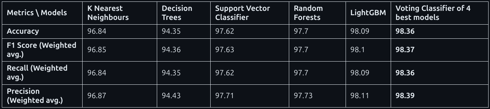

# Hand Gesture Recognition using MediaPipe and Machine Learning

## Overview

This project focuses on real-time hand gesture recognition by combining MediaPipe's hand tracking technology with machine learning classifiers trained on a prerecorded dataset of hand landmark positions.

The goal was to build an accurate, responsive system capable of detecting and classifying hand gestures from live webcam input.

## Project Overview

- Hand Landmark Detection: Used MediaPipe's Hands solution to extract 21 3D landmarks per detected hand from a live video stream.

- Data Source: Worked with a prerecorded dataset of hand landmark positions labeled with corresponding gesture classes.

- Model Training: Trained several classical machine learning models on the extracted landmark features.

- Model Selection: Selected the top-performing models based on evaluation metrics and combined them into a Voting Classifier for optimal performance.

- Real-time Inference: Deployed the final model for real-time hand gesture classification through webcam input.

## Technologies and Libraries

- Python 3.8+
- MediaPipe
- NumPy
- Pandas
- Scikit-learn
- Matplotlib
- OpenCV
- Lightgbm

Final Model: An ensemble Voting Classifier combining the best models achieved 98.36% accuracy.

Hand-Gestures-Recognition-project-with-mediapipe/
├── Hand_gestures_detection_with_Machine_Learning_and_Mediapipe.ipynb       # Development Notebook
├── hand_landmarks_data.csv                     
├── models/                                  
├── MLPack/
│   ├── Processing.py  
│   ├── model.joblib      
│   └── encoder.joblib 
├── README.md                  
├── requirements.txt           
├── Main.py
├── Personal/video/hand_gesture_output.mp4                    

## Key Learnings

- Effective integration of MediaPipe with machine learning pipelines.

- Importance of model evaluation across multiple metrics (Accuracy, F1-Score, Precision, Recall).

- Boosted ensemble methods (Voting Classifier) to enhance model performance.

- Handling real-time video streams and performing low-latency inference.

## How to Run the Project

1. Clone the Repository
    bash'''
        Copy
        Edit
        git clone https://github.com/yourusername/hand-gesture-recognition.git
        cd hand-gesture-recognition
    '''

2. Install Dependencies
    bash'''
        pip install -r requirements.txt
    '''

3. Run the Project
    bash'''
        python Main.py
    '''

4. View the Results
    Open the generated video file in your preferred video player.
    You will find it in the 'Personal/video/' folder that would be created after running the Main.py file.

## Example Output video

<video controls src="hand_gesture_output.mp4" title="Title"></video>

## Future Improvements

- Enhance model accuracy by Data Augmentation on various angles.

